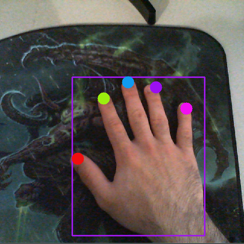

# FingerTrackingCursorControl (FTCC)

Cursor control based on VGG-16 CNN from [MahmudulAlam](https://github.com/MahmudulAlam/Unified-Gesture-and-Fingertip-Detection)

Repo for ECE471 project (Private; not for distribution).


### Installation
We recomend running our program wtih `pipenv` but `pip3` can work as well.

#### Pipenv
Ensure you have `pipenv` installed globally,
```sh
$ pip3 install pipenv
```
 and then,

```sh
$ cd /path/to/FingerTrackingCursorControl/src
$ pipenv install -r requirements.txt
$ pipenv run python real-time.py
```

#### Pip3
```sh
$ cd /path/to/FingerTrackingCursorControl/src
$ pip3 install requirements.txt
$ python real-time.py
```

## Cursor Control Examples
The following section shows the various different cursor controls that can be triggered uniquely using the gestures decribed in the table and imagery below.

| Cursor Action |     Thumb     |      Index     |     Middle     |      Ring       | Pinky |
| ------------- |:-------------:| :-------------:| :-------------:| :-------------: | -----:|
|      Move     |     -     |     ✔️      |     -     |      -       | - |
|  Left Click   |     ✔️     |      -     |     -     |      -       | ✔️ |
|  Right Click  |     -     |      ✔️     |     -     |      -       | ✔️ |
|   Scroll Up   |     -     |      ✔️     |     ✔️     |      -       | - |
|  Scroll Down  |     -     |      ✔️     |     ✔️     |      ✔️       | ✔️ |
|      Exit     |     ✔️     |      ✔️     |     ✔️     |      ✔️       | ✔️ |

### Image Gestures

#### Move
##### Moves the cursor to a mapped point on the user's monitor (Dynamic mapping)


#### Left Click
##### Imitates left click trigger at cursor location


#### Right Click
##### Imitates right click trigger at cursor location


#### Scroll Up
##### Imitates scrolling up at cursor location


#### Scroll Down
##### Imitates scrolling down at cursor location


#### Exit



### Dataset
[HCII - SCUT-Ego-Gesture](http://www.hcii-lab.net/data/SCUTEgoGesture/index.htm)


### License

MIT
